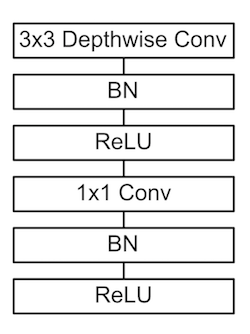

# CS348K Optional Assignment 2: Efficient MobileNet Conv Layer Evaluation #

__Note that this is an optional assignment, and can be used to add extra credit to your other assignments or final project.__

In this assignment you will implement a simplified version of the MobileNet CNN. In particular, this assignment is restricted to the evaluation of a single convolutional layer of the network. See https://arxiv.org/abs/1704.04861 for more details about the full network. Also, unlike Assignment 2, this assignemnt is focused on efficiency. Your code will be evaluated on how fast it runs.

# Why speedup MobileNets? #
The MobileNets DNN architecture was designed with performance in mind, and a major aspect of the network's design is the use of a *separable* convolution. So in this assignment you will implement a one part of the DNN which consists of the following sequence of stages:

 

Here `BN` stands for a batchnorm layer and `ReLU` is a rectified linear unit (see below for details).

#  What is the challenge? #
Implementing the layers correctly is easy. The challenge is to implementing them efficiently using many of the techniques described in class, such as SIMD vector processing, multi-core execution, and efficient blocking for cache locality. To make these techniques simpler, we encourage you to attempt an implementation in Halide. **You are allowed to use the reference Halide algorithm provided in the codebase verbatim**. However, to improve the performance you will need to write an efficient Halide schedule. The starter code uses a naive/default Halide schedule, which has loops that look like:

    produce output:
      for c:
        for y:
          for x:
            output(...) = ...
      for c:
        for y:
          for x:
            for pointwise_rdom:
              produce tmp:
                for c:
                  for y:
                    for x:
                      tmp(...) = ...
                for c:
                  for y:
                    for x:
                      for depthwise_rdom:
                        for depthwise_rdom:
                          tmp(...) = ...
                for c:
                  for y:
                    for x:
                      tmp(...) = ...
                for c:
                  for y:
                    for x:
                      tmp(...) = ...
              consume tmp:
                output(...) = ...
      for c:
        for y:
          for x:
            output(...) = ...
      for c:
        for y:
          for x:
            output(...) = ...

Your job then would be to write a custom Halide schedule that performs better than the default. (See [`Halide::Func::print_loop_nest()`](http://halide-lang.org/docs/class_halide_1_1_func.html#a365488c2eaf769c61635120773e541e1) to inspect and debug your schedule like this.)

# Resources and documentation #
* [Halide tutorials](http://halide-lang.org/tutorials/tutorial_introduction.html). In particular, see Tutorial 01 for a basic introduction, Tutorial 07 for a convolution example, and Tutorial 05 for an introduction to Halide schedules, and Tutorial 08 for more advanced scheduling topics.
* [Exhaustive Halide documentation](http://halide-lang.org/docs/).
* Details on the batchnorm layer:
  - https://leonardoaraujosantos.gitbooks.io/artificial-inteligence/content/batch_norm_layer.html
  - https://r2rt.com/implementing-batch-normalization-in-tensorflow.html
* [ReLU](https://en.wikipedia.org/wiki/Rectifier_(neural_networks))
* [TensorFlow-Slim documentation](https://github.com/tensorflow/tensorflow/tree/master/tensorflow/contrib/slim). In case you choose to compare your implementation to a TensorFlow version, we encourage use of *TensorFlow-Slim* which is easier to get off the ground with than TensorFlow proper.

# Going further #
To really see how good your implementation is, we encourage you to compare your performance against that of popular DNN frameworks like TensorFlow or MX.net. Since the algorithm for this assignment is fixed, you can even write an implementation in hand-tuned native C++ code (using AVX2 intrinsics and threading primitives). **Again, you are allowed to use the provided native C++ implementation verbatim**, but you should modify it to improve the performance.

# Assignment mechanics #

Grab the assignment starter code.

    git clone git@github.com:stanford-cs348v/asst2.git

To run the assignment, you will need to download the scene datasets, which you can get from the course staff upon request.

__Build Instructions__

The codebase uses a simple `Makefile` as the build system. However, there is a dependency on Halide. To get the code building right away *without Halide*, you can modify `Makefile`, and replace the lines

    DEFINES := -DUSE_HALIDE
    LDFLAGS := -L$(HALIDE_DIR)/bin -lHalide -ldl -lpthread

with

    DEFINES :=
    LDFLAGS := -ldl -lpthread

To build the starter code, run `make` from the top level directory. The assignment source code is in `src/`, and object files and binaries will be populated in `build/` and `bin/` respectively.

Once you decide to use Halide, follow the instructions at http://halide-lang.org/. In particular, you should [download a binary release of Halide](https://github.com/halide/Halide/releases). Once you've downloaded and untar'd the release, say into directory `halide_dir`, change the previous lines back, and also the following line in `Makefile`

    HALIDE_DIR=/Users/setaluri/halide

to

    HALIDE_DIR=<halide_dir>

Then you can build the code using the instructions above.

__Running the starter code:__

Now you can run the camera. Just run:

    ./bin/convlayer DATA_DIR/activations.bin DATA_DIR/weights.bin DATA_DIR/golden.bin <num_runs>

This code will run your (initially empty) version of the convolution layer using the activations in `DATA_DIR/activations.bin` and weights in `DATA_DIR/weights.bin`. It will run for `num_runs` trials, and report the timings across all runs, as well as validate the output against the data contained in `DATA_DIR/golden.bin`. Note that if you are using Halide, the command will be slightly different. On OSX it will be

    DYLD_LIBRARY_PATH=<halide_dir>/bin ./bin/convlayer <args>

and on Linux it will be

    LD_LIBRARY_PATH=<halide_dir>/bin ./bin/convlayer <args>

__Modifying the code__

Your modifications to the code should only go in files `fast_convolution_layer.hpp` and `fast_convolution_layer.cpp`, in the regions marked

    // BEGIN: CS348K STUDENTS MODIFY THIS CODE
    
    // END: CS348K STUDENTS MODIFY THIS CODE

If you need to make changes to the build system (e.g. add g++ flags to get vector intrinsics working) _please make a note of it in your submission_.

We have provided two reference implementations in `simple_convolution_layer.cpp` and `halide_convolution_layer.cpp`. You can use any of the code in these files for your implementation. In particular, you can (a) copy and paste the native C++ implementation as a starting point if you choose to go the native C++ route, and (b) copy the Halide algorithm (and just provide a custom schedule) if you choose to go the Halide route.
